# **Visualising the Ghost in the Machine**


**Update (16-17 Feb 2026):** 
I have finally found some time to create an interactive online demo available to everyone! It runs one of my pre-trained models directly in your browser using JavaScript. You can explore the latent space in real-time, generate digits, and even morph between them. **Check it out!**

##  [LIVE INTERACTIVE DEMO](https://antonpova.github.io/neural-ghost-mnist/)

---

### Project Context & Disclaimer
*This repository is an archive for a small multidisciplinary project I made in **November 2025**.*

**Why this project?**
I decided to build this neural network from scratch for four reasons:

0.  I was bored.
1.  I wanted to understand how basic neural networks work in detail (not just "use TensorFlow and 3 lines of code") and get some practice in it by coding backpropagation and optimization (Adam) manually, without high-level libraries.
2.  I had two assignments to do - **MATLAB** coding project (basic usage of language, loops, functions, etc) and a **Data Visualisation** project, so I overcomplicated them both.
3.  For years, I had an idea in mind to try compressing the images with a model, and then decompress it. It turned out, it had already been invented a couple of decades ago and was called an autoencoder, but I built it anyway.

*Note: The text below is (almost) the original project report submitted for the Data Visualisation module on November 26, 2025. If some parts feel off, please don't be alarmed - it's a snapshot of my learning journey!*

---


## **1. Introduction: The Black Box Problem**

Artificial Intelligence often feels like magic. We feed data into a
"black box," and it gives us an answer. But as engineers and data
scientists, "magic" isn't enough - we need understanding. This project
was created because I wanted to learn and *see* how a neural network
learns. I found an interesting excuse to start this project because of
this module (especially gestalt principles and how the human brain
organizes chaos into patterns), so I decided to build a machine that
does the same.

My goal was to train a Deep Autoencoder from scratch (using MATLAB,
manual backpropagation, and the custom Adam optimizer) to compress
images of handwritten digits (the MNIST dataset) that consists of images
with 28\*28=784 pixels down to just 2 latent coordinates. I hope this
report will give you some insights into how a mathematical model moves
from random noise to a structured understanding of "concepts," creating
a visual map of numbers.

## **2. Data Source and Methodology** 

The data for this visualization is
unique: it was not downloaded, but generated by the neural network I
built. The only source I used was MNIST dataset to train the model.

The engine:

I made a custom neural network with a “bottleneck” architecture:

``` math
input(784) \rightarrow 512 \rightarrow 128 \rightarrow 32 \rightarrow \lbrack 2\ latent\ neurons\rbrack
```

``` math
\lbrack 2\ latent\ neurons\rbrack \rightarrow 32 \rightarrow 128 \rightarrow 512 \rightarrow output(784)
```

The network forces the image to be squeezed into just two numbers (2
latent neurons) that we will use as x and y coordinates, and then
reconstructs the image back. Because of this extreme compression the
model is forced to learn the “essence” of every digit.

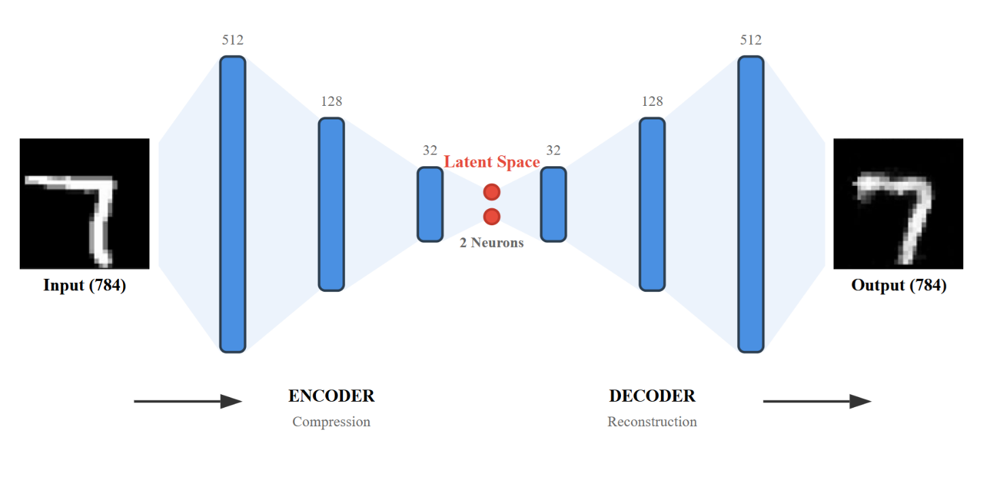

*Figure 1: Architecture of the Deep Autoencoder used to compress MNIST
digits.*

Data extraction:

To visualize the training processes and final results, I exported some
datasets from MATLAB to .csv format

## **3. Part I: the “Map of Digits”** 

Before analysing the training
process, we must understand the result. What does the “middle of the
brain” of this network look like? To visualize this, I used ggplot2 to
create a Scatterplot Diagram of the latent space.

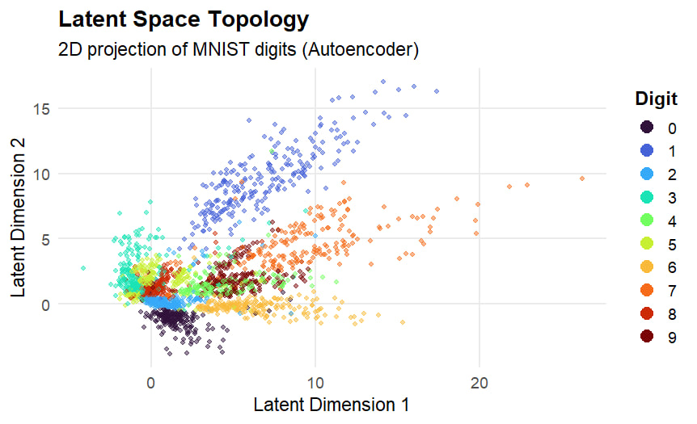

*Figure 2: The topology of the latent space. Each dot represents a
handwritten digit compressed into 2 coordinates. X and Y represent the
latent coordinates built by the model, and the hue represents a digit
label (0-9).*

This plot is probably a little bit hard to understand so let’s break it
down a little bit. The position of the dot represents the 2 values to
which our model compressed the image of the digit. The hue shows which
image was compressed (note, neural network wasn’t given these labels, so
it automatically found some common properties of the images and grouped
them together).

Let’s look a bit closer at some of the interesting properties of this
space.


### **The "Rays" of 1 and 7:**

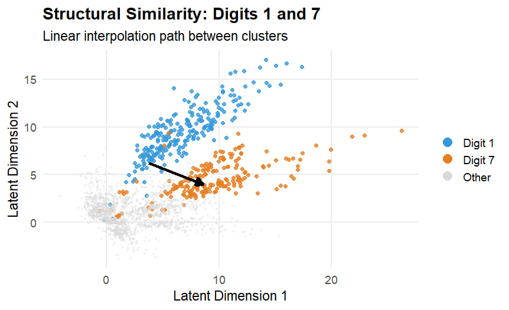

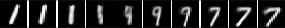

*Figure 3: Linear interpolation between clusters 1 and 7. Note the
intermediate stage where the top loop "unfurls" to create the horizontal
bar of the 7.*

Let’s zoom in on the interesting relationship between
digits **1** and **7**. In the scatterplot, they form two distinct
"rays" sitting right next to each other. This proximity isn't random:
the network grouped them because they share a dominant feature—the
vertical stroke.

But the real insight comes from the space *between* them. The black
arrow marks our path. Look at the morphing strip below: as we travel
from the **1** cluster to the **7**, the image doesn't just snap. We see
a smooth transformation. The vertical line tilts, and a small loop
appears at the top (resembling a squeezed **9**). As we get closer to
the destination, this loop unfurls and straightens out to form the
horizontal top bar of the **7**. This proves that the network isn't just
memorizing pixels: it has learned a continuous geometry where shapes
flow into one another.

### **The "Shape-Shifting" Path (4-9-7):**

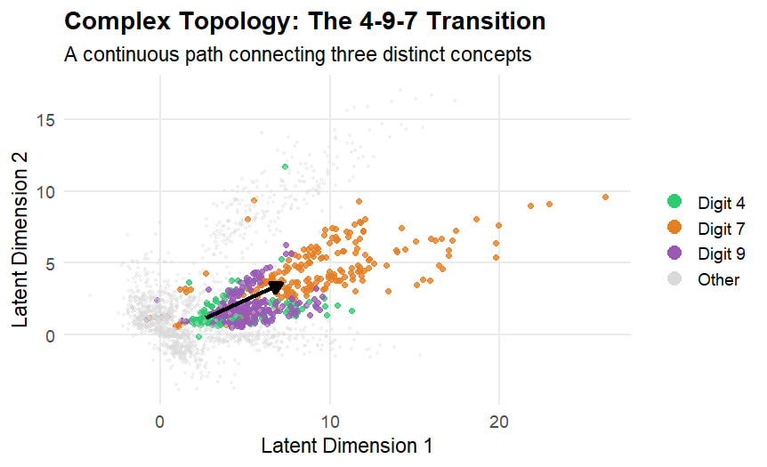

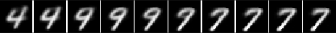

*Figure 4: A multi-stage transformation. The path shows how the network
smoothly interpolates from **4** to **9**, and finally to **7**, by
altering specific geometric features like the closed loop and the
vertical stroke.*

Figure 4 shows an even more “complex” relationship. Here, we see the
clusters for **4**, **9**, and **7** lying along a continuous
trajectory.

The black arrow marks a path that cuts through all three clusters. The
morphing strip below confirms the geometric logic behind this
arrangement.

1.  It starts with a **4**

2.  As we move along the path, the top vertical lines curve inward and
    touch, closing the loop to form a **9**

3.  Continuing further, the bottom curve straightens out, and the top
    bar sharpens, transforming the shape into a **7**

This is a really interesting insight: the 2D latent space has
captured the complex dependencies of handwriting. It shows that a
“9” is topologically a bridge between a **4** and a **7**, and also
between a **1** and a **7**!

### **Sub-clustering (The Style of 5):**

   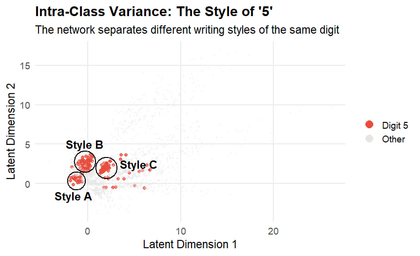

| Style A | Style B | Style C |
|----|----|----|
| 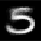 | 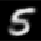 | 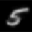 |

*Figure 5: Intra-class variance of the digit **5**. The scatterplot
highlights three distinct sub-clusters. The sample reconstructions
(bottom) reveal the stylistic differences: Style A (wide loop), Style B
(standard S-shape), and Style C (compact/small).*

Finally, let’s look at Figure 5. Here, I highlighted only the
digit **5**. Interestingly, they do not form a single blob but are split
into distinct sub-clusters.

If we look at the samples, the logic becomes clear:

1.  **Style A:** Characterized by a prominent, wide bottom loop. These
    digits appear "squat" and heavy at the bottom

2.  **Style B:** Represents the standard, balanced form, closely
    resembling an “S” shape with equal proportions

3.  **Style C:** A compact, smaller variant. These digits are written
    more tightly, with a noticeably smaller bottom loop and often a
    slight slant

This demonstrates that the Autoencoder captured not only differences
between different numbers, but also the style and scale of
handwriting without any supervision!

## **4. Part II: Visualisation as a Debugging Tool** 
Here I want to demonstrate that data visualisation is not just an instrument 
to present data to a broad audience, but a critical tool for conducting
research and optimizing complex systems.

**Defining the Metric: What is "Loss"?**

Before optimizing the model, we must understand what we are
measuring. The "pulse" of the network is the Loss Function (Mean
Squared Error):


1.  It calculates the difference between the original image pixels and
    the reconstructed output.

2.  The Goal is to minimize this value. A high loss means the output is
    blurry; a low loss means the network "understands" the digit.

3.  The X-axis (Epochs) represents the training time. One epoch means
    the network has seen the entire dataset once.

**The baseline:**

Initially, I trained the network with a standard Adam
optimizer. Figure 6 shows the result (Grey Line).

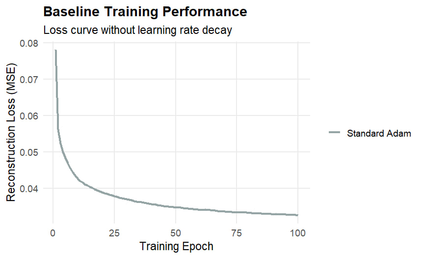

*Figure 6: Baseline training performance. The curve flattens out,
indicating that the model improves slower.*

We see rapid learning in the first ~15 epochs, but then the curve
hits a "plateau." The improvement slows down drastically.

However, numbers alone didn't tell the whole story. I visualized
the dynamic trajectories of points in MATLAB (tracking specific
digits in the latent space over time), see animation.mp4.


https://github.com/user-attachments/assets/ff9ad6d4-836f-4a91-8d7b-1dd7e3123851


[if video doesnt work for some reason, gif will]

Visual Insight: After epoch ~30, the points were not settling.
    Instead, they were oscillating wildly back and forth around their
    “optimal positions”.

Based on this evidence we can tell that “physics” of the simulation
    was too energetic. The Learning Rate was too high, causing the
    optimizer to "overshoot" the optimal position.

**Hypothesis & Experiment: Step Decay**

Based on this visual evidence, I hypothesized that reducing the
    speed would improve the learning process. I implemented a Step
    Decay strategy: multiplying the learning rate by 0.8 every 20
    epochs. Figure 7 compares this new approach (Red) with the Baseline
    (Grey).

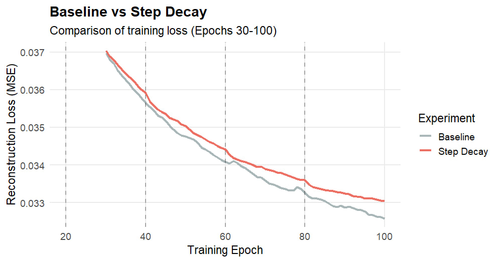

*Figure 7: Comparison of strategies. Vertical dashed lines mark the
    moments of rate reduction.*

At first glance, the experiment seems like a failure. The Red line
    (Step Decay) is actually higher (worse) than the grey line for most
    of the time. We slowed down the network too early, hindering its
    progress.\
    However, let’s look closer at the vertical lines. Exactly at the
    moments of rate reduction (epochs 40, 60, 80), the red curve shows a
    sharp downward slope. This proves that reducing the rate *does* help
    escape the plateau in this situation; we just applied it
    incorrectly.

**The Solution: Hybrid Strategy**

Combining these insights, I designed a proof of concept Hybrid
    Strategy:


1.  keep the fast Baseline speed for the first 80 epochs to reach the
    general vicinity of the solution quickly

2.  At epoch 80 (where the plateau is obvious), switch to a Rapid
    Decay mode (multiplying rate by 0.95 every epoch) to “freeze” the
    oscillations

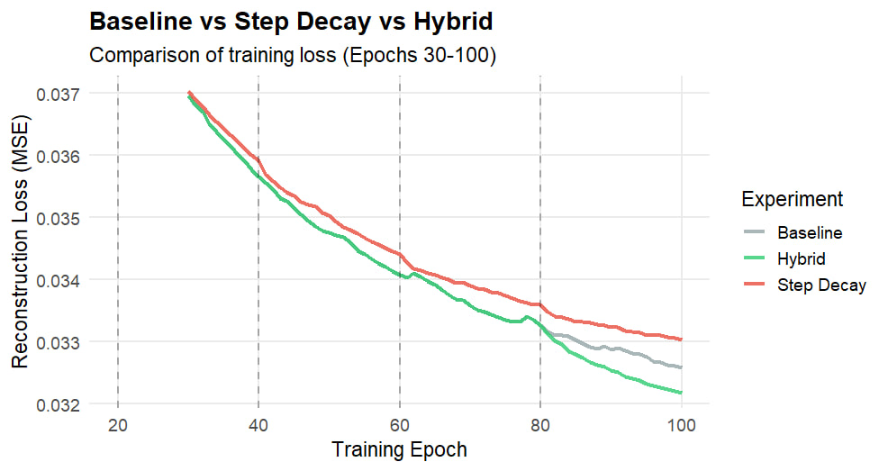

*Figure 8: The final Hybrid Strategy (Green) compared with the
    baseline and step decay.*

The Green line in Figure 8 confirms the theory. It follows the fast
    Baseline path, but after epoch 80, it breaks through the floor where
    the other models got stuck, achieving the lowest possible error.

**Conclusion:**

This workflow proves that visualization is an integral part of the
    R&D loop. Without seeing the oscillations and analysing the “knees”
    in the loss curve, we could have been blindly guessing parameters.
    Visualisation turned a “black box” process into an explainable and
    more controllable one. Of course, we can go further and play with
    other more complex strategies like sigmoid decay, but I think it’s
    enough for the demonstration.

## **5. Reflection** 
I hope this report demonstrates the importance of
    data visualisation not only in the final presentation but also in
    the research workflow itself. I used different plots: scatterplots,
    animated trajectories, and line charts for different purposes - to
    get insights into complex latent spaces and to debug the training
    process. Without data visualisation, this neural network would
    remain a "magic" (and likely unoptimized) black box.

This project required a lot of thought and work, but it was a
    valuable exercise in applying Gestalt principles to real engineering
    problems. For my own understanding, I might not need explicit
    techniques like enclosure or highlighting, but for a broader
    audience, these techniques are essential. I chose this project
    specifically because, without these design principles, explaining
    the topology of numbers would be nearly impossible.

I hope you found this data interesting and enjoyed the visuals.

## **6. PS:**

This project turned into a bit too deep dive into the intersection
    of Machine Learning and Data Visualisation. I’m now considering
    using these types of visualisations to teach others complex concepts
    through interactive visuals. However, I realize that my design
    choices are not perfect yet, and I am unsure if the current level of
    visualization is effective enough for a broader audience.

## **Credits:**
**Author:** Anton Povalishev
   
**Tools:** MATLAB, R, JavaScript.
   
**AI Disclosure:** I used GenAI (Gemini) to build and verify some visualisation scripts. All core logic and neural network training code were developed by me.

If you use any of this, please give me credit xD

Hope you have enjoyed it!

*by Anton Povalishev*
